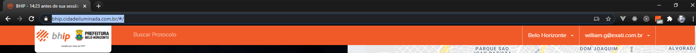

## 1. Configurações e arquivos

**Tecnologias**
- Vuejs
- PWA - Quasar
- Store: Vuex
- Eslint: erp
- Bundler: Webpack
- Http: Axios
- Mapa: Leaftlet
- Google maps api
- Jwt(15 min)


**Padrão de projeto e pastas**
```
.
├── App.vue # Aplicação
├── main.js # Cria a instância do vue e monta no index.html
├── public # Arquivos estáticos
│   ├── index.html # Placeholder 
├── .env # Endereço instância e configs como linguagem e etc.
├── eslint.js # regras de padrão de codificação
├── .gitIgnore # Arquivos que não são comitados
├── README.md # Base para pessoas que não conhecem o projeto
├── src
    ├─ components # Componentes da aplicação, separados por pastas
    │   └── meuComponente
    |       └── arquivo1.vue
    |       └── arquivo2.vue
    ├── pages # Telas da aplicação, separadas por pastas
    │   └── minhaPagina
    |       └── arquivo1.vue
    |       └── arquivo2.vue
    ├── router # Rotas da aplicação
    │   └── index.js
    ├── store # Local para guardar os arquivos do vuex.
    │   ├── store.js
    │   ├── modules
    │       └── ...       
    ├── services # todas as requisições feitas na aplicação ficam aqui
    ├── style # estilos gerais da aplicação
    |   ├── app.css
    ├── util # coisas uteis para usar em todo o projeto
    |   ├── util.js 
    ├── controller # todas as lógicas ficam aqui
    ├── translations # traduções da aplicação
    │   └── index.js
```

**Arquivo config (.env):**
- Base URL da instância ou lista de URLS (no caso do CI novo).

**OU**
- Lista de cidades, contendo url das intancias (evitar muitas requisições mobile). 

```
 servidor bhip
    roda esse script -> puxa o .env.bhip. do servidor central
    requisição publica pras configs traz:
      - cidades
      - nome da instancia
      - path das imagens

  servidor central
    .env.bhip
      URL_INSTANCIA: http://bhip...
    .env.macapa
      URL_INSTANCIA: http://macapa...
    .env.saoluis
      URL_INSTANCIA: http://saoluis...
    .env.consolidado
      URL_INSTANCIA: [
        http://saoluis... -> requisição: traz todos os parques e cidades
          adicionar uma cidade no banco.
          adicionar um parque.
        , http://saoluis... -> requisição: traz todos os parques e cidades
        , http://saoluis...  -> requisição: traz todos os parques e cidades
        , http://saoluis... -> requisição: traz todos os parques e cidades
      ] -> junta tudo na store
```

```bash
  #!/bin/bash

  echo "Qual a instancia (bhip, macapa, sao luis)?"
  read instancia

  echo "Precisa do build? (s/N)"
  read necessitaBuild
  if [ "$necessitaBuild" = "s" ]; then
    cp .env .env.original
    cp .env."$instancia" .env.production
    cp .env."$instancia" .env

    yarn build
    echo '' > .env.production
    mv .env.original .env

  fi

  if [ "$instancia" = "homologacao" ]; then
    rsync --delete-before -a dist andre@app.videnci.com:/usr/share/nginx/html/videnci/"$instancia"/
  fi

  if [ "$instancia" = "app" ]; then
    rsync --delete-before -a dist andre@app.videnci.com:/usr/share/nginx/html/videnci/"$instancia"/
  fi
```

**Banco de dados:**
- `<LISTA_CIDADES>`: Json
- `<NUMERO_TEL_CALLCENTER>`
- Esquema de cores do app (header, botões, detalhes, icones, etc)
    - Primary
    - Secondary
    - Tertiary
    - Padrões:
        - Warning
        - Success
        - Info
- Paths das imagens (favicon, brand, background, etc).
- Flags
  - Plaqueta
  - Num. Telefone (cadastro)
  - Necessidade de tirar fotos
  - Enviar SMS

**Verificar esquema de cores com o designer**

**Servidor**
- `<FAVICON_INSTANCIA>`
- `<BRAND_INSTANCIA>`
- `<BACKGROUND>`
- `<BACKGROUND_HEADER>`

## 2. Título e navbar

1. Título
    1. Tab ativa: `<INSTANCIA>` - Chamado
    1. Tab inativa: `<INSTANCIA>` - 14:59 antes de sua sessão encerrar. (retirar) - Token com refresh -1h
    1. `<FAVICON_INSTANCIA>`
1. NavBar
    1. `<BRAND_INSTANCIA>`: Redireciona para tela inicial.
        1. Caso no meio do fluxo de informar um problema, avisa ao usuário sobre possível perda dos dados preenchidos.
    1. Campo de busca: protocolo.
    1. Dropdown Seleção de cidade
        1. Campo de busca
        1. `<LISTA_CIDADES>`
    1. Botão
        1. Exibe "Entrar" caso usuário esteja deslogado
        1. Exibe `<EMAIL_USUARIO>` com dropdown com a opção de "Sair" caso usuário esteja logado (deixar mais bonito)

## 3. Tela inicial


1. Painel esquerdo
    1. Imagem `<BACKGROUND>` (arrumar layout quando tem lista de protocolos)
    1. Exibe "Informe Uma Cidade" caso cidade não esteja selecionada.
    1. Exibe `<NOME_CIDADE>` caso cidade esteja selecionada.
    1. Mensagem de boas vindas: "Seja bem-vindo(a) a `<INSTANCIA>`!"
    1. Botão "Informar um Problema".
        1. Redireciona para tela de cadastro caso usuário esteja deslogado.
        1. Redireciona para tela de seleção de local do problema (mapa) caso usuário esteja logado.
    1. Lista de protocolos, caso possua. (Card com table dos protocolos abertos)
1. Painel direito
    1. Exibe mapa centralizado na localização atual do usuário (ou na posição central da cidade selecionada) ?
    1. Marker ao centro: "Você está aqui".

## 4. Tela login/cadastro

1. Header
    1. Imagem `<BACKGROUND_HEADER>`
    1. "Cadastre-se para informar um problema"
1. Formulário Cadastro - Card
    1. CPF: obrigatório
    1. Email: obrigatório
    1. Campos após envio do código por e-mail:
        1. Nome: obrigatório
        1. Telefone: obrigatório
        1. Código:obrigatório
    1. Botão "Entrar"
        1. Caso não possua cadastro, exibe aviso que um e-mail foi enviado com código de confirmação.
            1. Após envio, aparecem os campos adicionais para o cadastro.
        1. Após cadastro ou se já possui cadastro: realiza o login e redireciona para a tela de seleção de local do problema.
    1. Link abaixo dos campos: "Reenviar código"
    1. Mensagem abaixo dos campos: "Caso deseje abrir um chamado sem se identificar ou não possua nenhum dos documentos solicitados, por gentileza ligar no `<NUMERO_TEL_CALLCENTER>`."

**Verificar campos (cpf), de acordo LGPD**

## 5. Tela seleção local problema

1. Header: "Informe o lugar do problema"
1. Mapa
  1. Marker na posição do usuário (ou posição default da cidade. Isto será definido na config do guia).
      1. Ao clicar, atualiza o endereço automaticamente e centraliza o mapa.
      1. Requisição com o lat/long escolhido
      1. Caso não encontrar o endereço no servidor através do latlon, colocar um placeholder e indicador de obrigatoriedade no input de endereço.            
  1. Card Endereço
      1. Input "Endereço/Plaqueta"
          1. Ao clicar, abre modal para seleção de endereço ou plaqueta
      1. Text input "Número"
      1. Text input "Referência"
      1. Botão "Próximo Passo" (bind com o formulário).
        1. Redireciona para a tela de seleção do tipo de problema.
  1. Modal seleção endereço/plaqueta
      1. Tab "Endereço"
          1. Text Input "Endereço": Exibe lista com endereços ao digitar.
              1. Ao clicar em algum endereço, seleciona o mesmo na tela principal e fecha a modal.
          1. Texto de ajuda "Digite para encontrar algum endereço"
          1. Link "Não encontrou? Clique aqui para digitar": Abre tela para digitar endereço livre
              1. Text input "Endereço": endereço livre.
              1. Text input "Número"
              1. Auto complete "Bairro"
              1. Botões "Ok" e "Cancelar"
          1. Botão "Cancelar"
      1. Tab "Plaqueta"
          1. Text input plaqueta
            1. Ao digitar e apertar enter, caso exista, o ponto ponto aparece em um card logo abaixo, ao clicar o ponto é selecionado "Etiqueta: `<PLAQUETA>`" na tela principal e o mapa é centralizado no ponto.
          1. Botão "Cancelar"

## 6. Tela seleção tipo problema

1. Header
    1. Mapa desabilitado
    1. Endereço ao centro do mapa
    1. Botão (ícone) de edição após endereço: redireciona para a tela de seleção de local do problema.
1. Card "Informe o problema"
    1. Botões (ícone + descrição) de seleção de tipo de problema
    1. Text input "Observação"
    1. Botão próximo passo: redireciona para a tela de listagem dos problemas adicionados.

## 7. Tela listagem problemas adicionados

1. Header "Lista dos problemas que você adicionou"
1. Cards com os problemas adicionados
    1. Descrição
    1. Endereço
    1. Data da solicitação
    1. Botão "X": Excluí o problema
    1. Simbolo Anexo (possibilidade de visualizar o anexo na lista)
1. Botão "Adicionar novo": redireciona para a tela de seleção de local do problema para criar uma nova solicitação/problema.
1. Botão "Concluir e enviar": envia os problemas selecionados/criados para o sistema.
    1. Após envio, exibe mensagem informando o protocolo e redireciona para a tela inicial.
